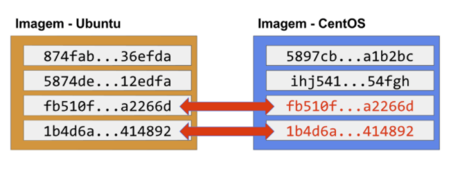
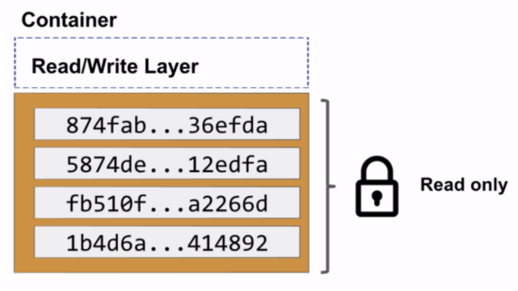
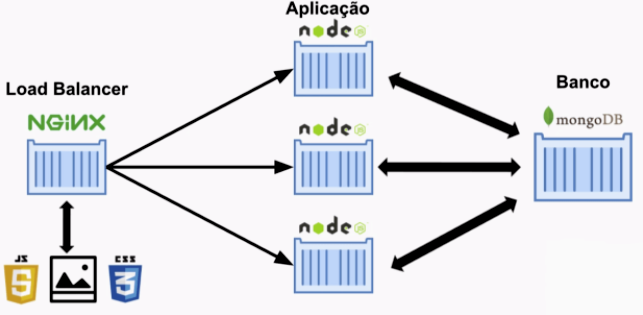

# Docker
A Docker, Inc: empresa (antiga dorCloud) é uma coleção de tecnologias para facilitar o deploy e a
execução de uma aplicação. O Docker possibilita configurar ambientes que são exatamente como um servidor
de produção e permite que qualquer pessoa trabalhe no mesmo projeto com exatamente as mesmas configurações, independentemente do ambiente de _host_ local. 

As configurações são descritas em arquivos simples facilmente aplicáveis pelo desenvolvedor e é uma 
tecnologia _open source_ ([Github da Docker, Inc](https://github.com/docker)).

## Camadas de uma imagem
Toda imagem é composta de uma ou mais camadas (_Layered File System_). As camadas podem ser reaproveitadas
em outras imagens (o Docker faz isso automaticamente ao baixar imagens com camadas iguais).


> Camadas de uma imagem

As camadas de uma imagem são apenas para leitura. Não escrevemos em cima da imagem, escrevemos na nova 
camada que o _container_ cria acima da imagem.

Um _container_ pode ser considerado uma instância de uma imagem.


> Camada criada pelo container

Podemos criar diversos _containers_ a partir de uma imagem (criando, assim, diversas camadas _read_/_write_).

Os _containers_ são criados e removidos rapidamente e facilmente.

## Volumes

Volume de dados dentro do _container_, lugar para salvar os dados quando o _container_ for removido. 
Quando criamos um volume, criamos uma pasta dentro do container e o apontamos para uma pasta no _Docker
Host_.

Podemos atrelar o volume com qualquer lugar, como banco de dados e código fonte.

## Dockerfile

Arquivo de texto lido pelo docker para criar uma imagem (extensão ```.dockerfile``` ou o nome padrão Dockerfile). 
Cada instrução do Dockerfile gera uma nova camada da imagem.

Cada camada (ou comando) ao rodar o `build` ganha um `id`, então caso for preciso alterar a imagem, basta 
alterar a camada, com as outras partes intermediárias já prontas.  

## Redes no Docker

É comum separar as partes de uma mesma aplicação em mais de um _container_, para que cada container tenha 
apenas uma responsabilidade. Então, para a aplicação funcionar, os containers precisam se comunicar.

Por padrão, no Docker já existe uma default _network_, ou seja, todos os _containers_ criados funcionam
na mesma rede por padrão (`bridge`).

Na rede padrão os _containers_ só podem se comunicar utilizando o IP gerado pelo próprio Docker. Podemos 
criar nossa própria rede e atribuir nomes para mapear a comunicação entre os containers da nossa 
aplicação, desde que os _containers_ estejam na mesma rede.

## Docker Compose

Lidando com múltiplos _containers_ simultaneamente.

Quanto maior a aplicação, mais _containers_ precisamos. Isso torna o processo manual muito extenso e 
suscetível a erros.


> Exemplo de uma aplicação

O Docker Compose funciona seguindo um arquivo YAML (.yml), que descreve o processo de build.


